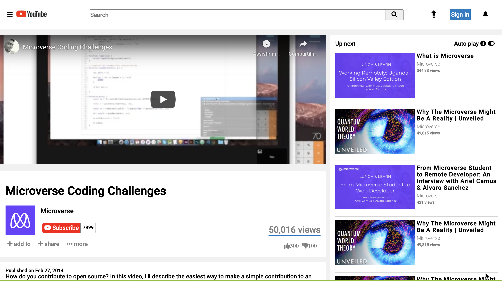

# Project Name

> This project was developed as a learning project part of the Microvese curriculum

A simple HTML and CSS mock up of the Youtube video webpage

## Live demo

🔗 https://raw.githack.com/enkog/Embedding-images-and-videos/develop/index.html

## Built With

- HTML5,
- CSS3,
- Google Fonts
- Font awesome

## Getting Started

To get a local copy up and running follow these simple example steps.

### Prerequisites

Webbrowser and access to internet

### Install

There is no need to installation, just run the index.html file

### Usage

Just navigate through the page the only functioning part of the project is the video player

## Authors

👤 **Diego Lira**

- Github: [@lirad](https://github.com/lirad)
- Twitter: [@lirad](https://twitter.com/lirad)

👤 **Nkiruka Awotoruvie**

- Github: [@enkog](https://github.com/enkog)
- Twitter: [@enkodes](https://twitter.com/enkodes)

## 🤝 Contributing

Contributions, issues and feature requests are welcome!

Feel free to check the [issues page](issues/).

## Show your support

Give a ⭐️ if you like this project!

## Acknowledgments

- Microverse for showing the way for this project to happen

## 📝 License

This project is [MIT](lic.url) licensed.
